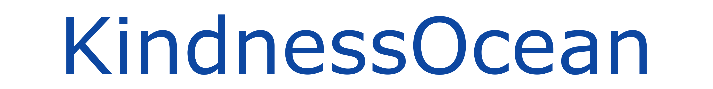

<h1 align="center" style="border-bottom: none">
<b>
    
     
</b>
    🌊️  A place for contribute in kindness  🌊️  
</h1>

    <a href="https://kindnessocean.com"><b>Website</b></a>

## Stay Up-to-Date

## Why Are We Building This?

About project info

## Getting Started with development
Please view the [documentation](docs/DOCS.md) for OS specific development instructions

## Roadmap

[KindnessOcean Roadmap](ROADMAP.md)

If you'd like to propose a feature, submit an issue [here](https://github.com/kindnessocean/kindnessocean/issues).

## **Releases**

Please see the [changelog](RELEASES.md) for more details about a given release.

## Contributing

Contributions are what make the open source community such an amazing place to be learn, inspire, and create. Any contributions you make are **greatly appreciated**. Please look at [CONTRIBUTING.md](CONTRIBUTING.md) for details.

## License

Distributed under the AGPLv3 License. See `LICENSE.md` for more information.